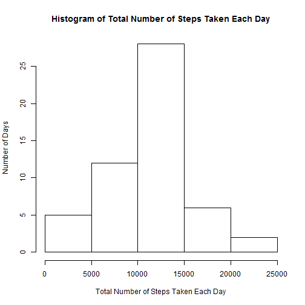
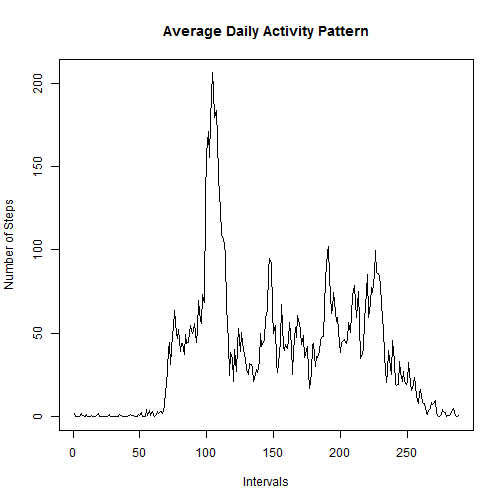
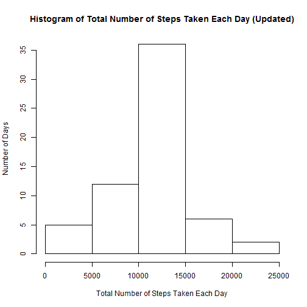
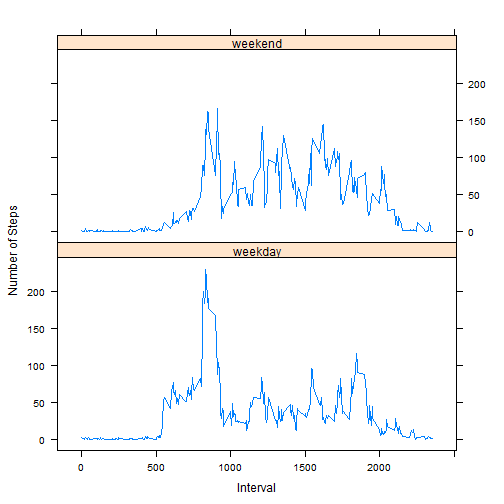

Reproducible Research: Peer Assessment 1
==========================================


## Loading and preprocessing the data
#### Show any code that is needed to
1. Load the data (i.e. read.csv())

```r
data <- read.csv("./activity.csv")
```

2. Process/transform the data (if necessary) into a format suitable for your analysis.  
**The format of the data is suitable already for my analysis.**

## What is mean total number of steps taken per day?
#### For this part of the assignment, you can ignore the missing values in the dataset.  
1. Calculate the total number of steps taken per day

```r
ttlstepsperday <- with(data, tapply(steps, date, sum)); ttlstepsperday
```

```
## 2012-10-01 2012-10-02 2012-10-03 2012-10-04 2012-10-05 2012-10-06 
##         NA        126      11352      12116      13294      15420 
## 2012-10-07 2012-10-08 2012-10-09 2012-10-10 2012-10-11 2012-10-12 
##      11015         NA      12811       9900      10304      17382 
## 2012-10-13 2012-10-14 2012-10-15 2012-10-16 2012-10-17 2012-10-18 
##      12426      15098      10139      15084      13452      10056 
## 2012-10-19 2012-10-20 2012-10-21 2012-10-22 2012-10-23 2012-10-24 
##      11829      10395       8821      13460       8918       8355 
## 2012-10-25 2012-10-26 2012-10-27 2012-10-28 2012-10-29 2012-10-30 
##       2492       6778      10119      11458       5018       9819 
## 2012-10-31 2012-11-01 2012-11-02 2012-11-03 2012-11-04 2012-11-05 
##      15414         NA      10600      10571         NA      10439 
## 2012-11-06 2012-11-07 2012-11-08 2012-11-09 2012-11-10 2012-11-11 
##       8334      12883       3219         NA         NA      12608 
## 2012-11-12 2012-11-13 2012-11-14 2012-11-15 2012-11-16 2012-11-17 
##      10765       7336         NA         41       5441      14339 
## 2012-11-18 2012-11-19 2012-11-20 2012-11-21 2012-11-22 2012-11-23 
##      15110       8841       4472      12787      20427      21194 
## 2012-11-24 2012-11-25 2012-11-26 2012-11-27 2012-11-28 2012-11-29 
##      14478      11834      11162      13646      10183       7047 
## 2012-11-30 
##         NA
```

2. If you do not understand the difference between a histogram and a barplot, research the difference between them. Make a histogram of the total number of steps taken each day.

```r
hist(ttlstepsperday, main = "Histogram of Total Number of Steps Taken Each Day", xlab = "Total Number of Steps Taken Each Day", ylab = "Number of Days")
```



3. Calculate and report the mean and median of the total number of steps taken per day

```r
mean(ttlstepsperday, na.rm = TRUE)
```

```
## [1] 10766.19
```
**The mean total number of steps taken per day is 10766.19.**

```r
median(ttlstepsperday, na.rm = TRUE)
```

```
## [1] 10765
```
**The median total number of steps taken per day is 10765.**


## What is the average daily activity pattern?
1. Make a time series plot (i.e. type = "l") of the 5-minute interval (x-axis) and the average number of steps taken, averaged across all days (y-axis).

```r
avgDAP <- with(data, tapply(steps, interval, mean, na.rm=TRUE))
plot(avgDAP, main = "Average Daily Activity Pattern", type = "l", xlab = "Intervals", ylab = "Number of Steps")
```



2. Which 5-minute interval, on average across all the days in the dataset, contains the maximum number of steps?

```r
which.max(avgDAP)
```

```
## 835 
## 104
```
**The $104^{th}$ interval, a.k.a. the 835 to 845 minute interval, contains the maximum number of steps on average across all the days.**


## Imputing missing values
#### Note that there are a number of days/intervals where there are missing values (coded as NA). The presence of missing days may introduce bias into some calculations or summaries of the data.  
1. Calculate and report the total number of missing values in the dataset. (i.e. the total number of rows with NAs)

```r
sum(is.na(data$steps))
```

```
## [1] 2304
```
**There are 2,304 rows with NAs.**

2. Devise a strategy for filling in all of the missing values in the dataset. The strategy does not need to be sophisticated. For example, you could use the mean/median for that day, or the mean for that 5-minute interval, etc.  
**In the code chunk below, the NAs are replaced by the means for the 5-minute intervals.**

```r
vavgDAP <- rep(as.vector(avgDAP), length(unique(data$date))) #then replace the corresponding NA values
head(vavgDAP)
```

```
## [1] 1.7169811 0.3396226 0.1320755 0.1509434 0.0754717 2.0943396
```

3. Create a new dataset that is equal to the original dataset but with the missing data filled in.

```r
Newdata <- data #Create a new dataset
ordinal.na <- which(is.na(data$steps)) #sequential number of NAs
Newdata$steps[ordinal.na] <- vavgDAP[ordinal.na] #replace NAs
head(Newdata)
```

```
##       steps       date interval
## 1 1.7169811 2012-10-01        0
## 2 0.3396226 2012-10-01        5
## 3 0.1320755 2012-10-01       10
## 4 0.1509434 2012-10-01       15
## 5 0.0754717 2012-10-01       20
## 6 2.0943396 2012-10-01       25
```

4. Make a histogram of the total number of steps taken each day and Calculate and report the mean and median total number of steps taken per day. Do these values differ from the estimates from the first part of the assignment? What is the impact of imputing missing data on the estimates of the total daily number of steps?

```r
ttlstepsperdayNew <- with(Newdata, tapply(steps, date, sum))
hist(ttlstepsperdayNew, main = "Histogram of Total Number of Steps Taken Each Day (Updated)", xlab = "Total Number of Steps Taken Each Day", ylab = "Number of Days")
```




```r
mean(ttlstepsperdayNew)
```

```
## [1] 10766.19
```
**The mean total number of steps taken per day is 10766.19.**  


```r
median(ttlstepsperdayNew)
```

```
## [1] 10766.19
```
**The median total number of steps taken per day is 10766.19.**   

**The new median is slightly greater than the old one, while the mean does not change. In this case, imputting missing data causes the original distribution slightly skew leftwards.**


## Are there differences in activity patterns between weekdays and weekends?
#### For this part the weekdays() function may be of some help here. Use the dataset with the filled-in missing values for this part.
1. Create a new factor variable in the dataset with two levels - "weekday" and "weekend" indicating whether a given date is a weekday or weekend day. 

```r
Newdata$day <- weekdays(as.POSIXct(Newdata$date, "%Y-%b-%d"))
Newdata$day <- factor(ifelse(Newdata$day %in% c("Saturday", "Sunday"),
                "weekend", "weekday"))
head(Newdata)
```

```
##       steps       date interval     day
## 1 1.7169811 2012-10-01        0 weekday
## 2 0.3396226 2012-10-01        5 weekday
## 3 0.1320755 2012-10-01       10 weekday
## 4 0.1509434 2012-10-01       15 weekday
## 5 0.0754717 2012-10-01       20 weekday
## 6 2.0943396 2012-10-01       25 weekday
```

2. Make a panel plot containing a time series plot (i.e. type = "l") of the 5-minute interval (x-axis) and the average number of steps taken, averaged across all weekday days or weekend days (y-axis). See the README file in the GitHub repository to see an example of what this plot should look like using simulated data.  

```r
temp <- aggregate(steps ~ interval + day, data = Newdata, mean) #temp data by intervals and day
library(lattice)
xyplot(steps ~ interval | day, data = temp, type = "l",layout = c(1,2), xlab = "Interval", ylab = "Number of Steps")
```



**The activity pattern at weekends and on weekdays are different. On weekdays people tend to walk more on early morning. At weekends people tend to walk more in the afternoon and at night.**
